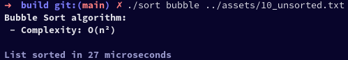
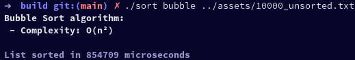

# Sorting-Algorithms
This repository give access to 5 different sorting algorithms developed in C++. 
You'll see in the terminal complexity of the algorithm and time of execution to sort the numbers. 

## Setup:

```
git clone git@github.com:DonatNathan/sorting-algorithms.git
cd sorting-algorithms
mkdir build
cd build
```

## Compilation:

```
cmake ..
make -j$(expr $(nproc) / 2)
```

## Usage:

```
./sort [algorithm_name] [file_path]
```

### Valid algorithms names:

| Name | Value |
| :---: | :---: |
| Insertion Sort | insertion |
| Selection Sort | selection |
| Bubble Sort | bubble |

### Valid input files:

You can find some examples of input files in the **assets** folder at the root of the repository.

If you want to create your own file, you must write all the number on the same line split by a space. Here an example:

> 10 9 8 7 6 5 4 3 2 100

## Output:

An output file named **sortedNumbers.txt** can be found in the build folder. 

## Results:

Bubble Sort - 10 unsorted numbers:\


Bubble Sort - 10000 unsorted numbers:\

